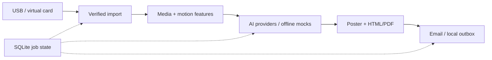

<div align="center">


# Day Distiller Desktop

### From a day's fragments to a memory worth revisiting.

The desktop companion for the Day Distiller wearable — verified import, multimodal analysis and a Daily Journal.

**Windows x64 · Apple Silicon macOS · Python / PySide6**

**English** · [简体中文](README.zh-CN.md)

[Project & firmware](https://github.com/zjmdong/Day_Distiller/tree/firmware-production) · [Quick start](#quick-start) · [Development](#development) · [Hardware](https://github.com/zjmdong/Day_Distiller/blob/firmware-production/docs/HARDWARE.md)

</div>

---

## Overview

Day Distiller is an independently developed hardware-to-software project by **JerryZ**. A custom wearable captures short video, audio and motion records; this application turns those records into a manageable daily reflection instead of another folder of media.

The desktop work spans device communication, storage verification, recoverable background jobs, native UI, media preprocessing, AI orchestration and report delivery. It is part of the same five-month project as the custom electronics, firmware and magnetic enclosure.

> This is the current **`desktop-app`** branch, package version **0.3.0**. The main project and embedded firmware are on [`firmware-production`](https://github.com/zjmdong/Day_Distiller/tree/firmware-production). Older `old/*` branches preserve earlier development snapshots; they are not the recommended starting point. The current application UI is primarily Chinese.

## The experience

**Connect → Verify → Select a day → Distil → Revisit**

| Area | What is implemented |
| :--- | :--- |
| **Start** | Guided device discovery and synchronisation, with progress and retry paths |
| **Memories** | Date-based journal history, editing, regeneration and resend |
| **Appearance & style** | Reference portrait, five built-in art directions, custom style prompt and one-off style previews |
| **Settings** | Provider configuration, system-keyring credentials and developer tools |

Under the interface:

- USB CDC discovery and capability-gated support for legacy, 2.0 and 2.1 firmware; MSC transitions and device settings where supported.
- File-size and SHA-256 checks before imported data moves into the processing pipeline; SQLite-backed job and recovery state.
- FFprobe/FFmpeg media validation and keyframe extraction; IMU features and heuristic activity classification, with an optional scikit-learn model.
- Qwen-based audiovisual analysis, DeepSeek-based daily moment selection and Seedream image generation through configurable provider adapters.
- A 3:4 illustrated poster, HTML/PDF journal, embedded email imagery and delivery receipts; source cleanup is a separate, verified step rather than an immediate side effect of copying.
- Deterministic mock AI and local `.eml` output for development without cloud keys or an email service.

## Quick start

### Requirements

- **Python 3.11** is the reference development/build version (`pyproject.toml` permits 3.11+).
- **FFmpeg and FFprobe** available on `PATH` when running from source. Packaged builds bundle them.
- Windows x64 or Apple Silicon macOS for the intended desktop/device workflow. A Linux data-directory fallback exists, but this is not a claim of supported Linux device integration.

Keep a separate checkout from the firmware:

```sh
git clone --branch desktop-app https://github.com/zjmdong/Day_Distiller.git Day_Distiller_Desktop
cd Day_Distiller_Desktop
```

**Windows / PowerShell**

```powershell
py -3.11 -m venv .venv
.\.venv\Scripts\python.exe -m pip install -e ".[dev]"
ffmpeg -version
ffprobe -version
.\.venv\Scripts\python.exe -m day_distiller_client
```

**Apple Silicon macOS** — use a native arm64 Python 3.11 installation:

```sh
python3.11 -m venv .venv
source .venv/bin/activate
python -m pip install -e '.[dev]'
ffmpeg -version
ffprobe -version
python -m day_distiller_client
```

### Try it without a device or API keys

1. Prepare a **copy** of a compatible TF-card recording folder. Each `REC_NNNN_YYMMDD_HHMMSS` directory contains `video.avi`, `audio.wav`, `imu.json` and `meta.json`; see the [recording format](https://github.com/zjmdong/Day_Distiller/blob/firmware-production/docs/GETTING_STARTED.md#5-understand-the-recording-format). Personal recordings are intentionally not bundled.
2. Open **Settings / 设置 → Developer settings / 开发者设置**. Use the records page to select the virtual TF-card folder and a date.
3. On the generation page, choose **Offline demo / 离线演示（零云端调用）**. Leave the option to delete virtual-card records **disabled**.
4. Import and run the workflow. Mock providers make no AI or SMTP calls; mail is written to `mock_outbox` under the application data directory. Media preprocessing still runs locally.

Mock output validates plumbing and presentation, not real AI quality. For fixture-driven checks without recordings, run the test suite.

### Connect a real device

Use compatible [HW 2.0 firmware](https://github.com/zjmdong/Day_Distiller/tree/firmware-production), a data-capable USB cable and a backed-up card. Let the app probe with `HELLO`; do not guess the protocol port or keep a terminal attached to it. USB storage transitions re-enumerate the device, so port names can change.

Start with read-only import. Eject the volume before exiting MSC. For modern transactional firmware, the app uses firmware export manifests and explicit cleanup commits; legacy devices use separately verified host-side cleanup. A failed import or generation must not be treated as permission to delete source records.

### Enable real generation

Configure your own provider endpoints, model IDs and credentials in Settings, then configure email and appearance. Provider availability and pricing are external to this repository; confirm them in your account rather than treating the defaults as guaranteed access.

| Guide | Scope |
| :--- | :--- |
| [Model configuration](docs/mainland-model-setup.md) | Qwen, DeepSeek and Seedream setup |
| [User guide](docs/user-guide.md) | Daily workflow and Resend SMTP configuration |
| [Appearance & style](docs/avatar-setup.md) | Reference portrait and art direction |
| [Firmware compatibility](docs/firmware-2.1-desktop-adaptation.md) | Device capabilities, status and settings |
| [Troubleshooting](docs/usb-ffmpeg-troubleshooting.md) | USB, storage and media tools |

These detailed operational guides are currently in Chinese. SMTP acceptance means a server accepted the message, not that the recipient has read it. Review the application's cleanup options before using valuable source data.

## Architecture



| Code | Responsibility |
| :--- | :--- |
| [`app.py`](src/day_distiller_client/app.py), [`ui_theme.py`](src/day_distiller_client/ui_theme.py) | PySide6 interface, navigation and worker-driven progress |
| [`protocol.py`](src/day_distiller_client/protocol.py), [`device.py`](src/day_distiller_client/device.py) | SLIP/CRC32 framing, discovery and device commands |
| [`device_workflow.py`](src/day_distiller_client/device_workflow.py), [`export_adapter.py`](src/day_distiller_client/export_adapter.py) | Firmware capabilities, import sessions and cleanup adapters |
| [`legacy_import.py`](src/day_distiller_client/legacy_import.py), [`database.py`](src/day_distiller_client/database.py) | Verified file imports and persisted job/history data |
| [`media.py`](src/day_distiller_client/media.py), [`imu_analysis.py`](src/day_distiller_client/imu_analysis.py) | Local media processing and motion features |
| [`providers/`](src/day_distiller_client/providers), [`pipeline.py`](src/day_distiller_client/pipeline.py) | Swappable external/mock services and pipeline orchestration |
| [`reporting.py`](src/day_distiller_client/reporting.py), [`credentials.py`](src/day_distiller_client/credentials.py) | HTML/PDF output and OS keyring access |

## Development

With the virtual environment activated:

```sh
python -m pytest -q
```

Tests cover protocol framing, import verification, job state, pipeline recovery, provider adapters, reports and UI behaviour. Mock tests are not hardware endurance tests and do not validate live providers. Never use real personal recordings or production keys as fixtures.

Build the native package **on the target platform**:

```powershell
# Windows x64
.\scripts\build.ps1
```

```sh
# Apple Silicon macOS
./scripts/build_macos.sh
```

The Nuitka builds produce `dist/DayDistiller-Windows-x64.zip` and `dist/DayDistiller-macOS-AppleSilicon.zip`. Distribute the complete package, not the executable alone. See [build documentation](docs/nuitka-build.md) and the manually triggered [Windows/macOS workflow](.github/workflows/build-desktop.yml). macOS packaging uses ad-hoc signing; that is not Developer ID notarisation.

For an AI extension, implement the relevant interface in [`providers/base.py`](src/day_distiller_client/providers/base.py), wire it into the pipeline and add mock-driven tests. For USB changes, update the C firmware and Python implementation together and preserve capability negotiation.

## Data, privacy & limitations

| Platform | Default application data |
| :--- | :--- |
| Windows | `%LOCALAPPDATA%\DayDistillerV2` |
| macOS | `~/Library/Application Support/Day Distiller` |
| Override | Set `DAY_DISTILLER_DATA_DIR` before launch |

Imported media, journal outputs, cache and the SQLite database are local files, **not an encrypted vault**. API and SMTP secrets use the system keyring; the local settings interface can display saved secrets in plain text, so keep it out of screenshots and screen recordings.

Real generation sends selected media/context to external AI providers and uses an external email service. Offline mock mode does not. Review consent, recipients and provider policies before enabling real mode. AI can omit or misinterpret details; activity classification is not ground-truth sensing. Longer hardware interruption tests, wearability studies and reliability validation remain ongoing prototype work.

## Author & licensing

**JerryZ** — the independently developed desktop companion to Day Distiller's custom hardware and firmware.

No project-wide software license is supplied. Public visibility is not an open-source license; contact the author before reuse or redistribution. Third-party dependencies retain their own licenses. The original hardware manufacturing files are not distributed.
