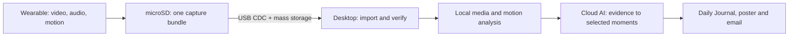

<div align="center">

# Day Distiller

### Keep the moments. Distil the day.

A wearable camera and desktop companion that turn fragments of everyday life into a Daily Journal.

**Custom hardware · Embedded systems · Desktop software · Multimodal AI**

**English** · [简体中文](README.zh-CN.md)

[Get started](docs/GETTING_STARTED.md) · [Hardware](docs/HARDWARE.md) · [Desktop app](https://github.com/zjmdong/Day_Distiller/tree/desktop-app) · [Engineering](#engineering-highlights)

</div>

---

## Why Day Distiller?

A busy day can be full of experiences and still be difficult to remember by evening. Phone photography asks us to recognise an important moment before it disappears; writing a diary asks us to reconstruct it afterwards. Recording everything creates a different problem: too much footage to revisit.

Day Distiller explores the space in between. A small, chest-worn device captures short visual, audio and motion fragments. Back at a computer, a desktop app verifies and organises the recordings, then uses multimodal AI to select meaningful moments and create a journal with an illustrated daily poster.

**Designed and built independently by JerryZ over five months:** interaction design, component selection, two PCB revisions, hand assembly, embedded firmware, a CAD-developed magnetic enclosure, desktop application and AI workflow. PCB V1 exposed microphone-assembly and camera-connector problems; those findings informed PCB V2 and the revised enclosure.

> **Project status:** a working, integrated personal prototype, not a production-certified wearable. This is the main firmware branch, `firmware-production`, currently identifying itself as **2.1.0**. The desktop application lives on [`desktop-app`](https://github.com/zjmdong/Day_Distiller/tree/desktop-app). The branch name does not imply that long-duration reliability or battery-life validation is complete.

## From a fragment to a memory



Capture and storage run on the ESP32-S3. Import, preprocessing and journal history run on the computer. Real AI generation uses configured external services; it does **not** run on the wearable. An offline mock workflow is available for development.

## What it does

| Layer | Implemented capabilities |
| :--- | :--- |
| **Capture** | Five-second recording windows, timer-based capture, optional IMU wake, and manual capture through the device web interface. Video, audio and motion share a capture identity and timing reference. |
| **Device experience** | Wi-Fi captive portal, camera preview, microphone waveform and IMU telemetry, configuration storage, RTC/NTP timekeeping, battery monitoring and RGB feedback. |
| **Storage & power** | microSD recording bundles, temporary-to-complete directory publication, deep sleep between tasks and low-battery handling. |
| **USB link** | Framed CDC control, capability negotiation, read-only/read-write mass-storage modes, cached status and revision-checked settings. |
| **Desktop companion** | Windows and Apple Silicon macOS workflows for device discovery, date-based import, file-size/SHA-256 verification, recoverable jobs and journal history. |
| **Daily Journal** | FFmpeg preprocessing, motion features, multimodal evidence analysis, moment selection, an illustrated poster, HTML/PDF output and email delivery. |

The default capture configuration requests **1920 × 1080 at 15 fps**, **16 kHz mono audio** and **104 Hz IMU sampling**. These are configured targets, not throughput guarantees. The recording metadata carries actual frame counts, rates and per-stream timing so that performance can be checked rather than assumed.

## Engineering highlights

The project is built around the boundaries between systems, not just their individual features.

- **Coordinated acquisition.** FreeRTOS tasks use readiness/start/stop events and a shared monotonic epoch. Per-stream offsets make timing observable without claiming hardware-level synchronisation. See [`recorder.c`](main/src/media/recorder.c).
- **Complete records, explicit failures.** Capture files are written under a temporary directory; metadata and file finalisation precede publication to the recording root. Incomplete work is distinguishable from a completed recording. See [`storage_service.c`](main/src/storage/storage_service.c).
- **A protocol designed for two applications.** SLIP framing, CRC32, sequence numbers and JSON payloads connect independently implemented C and Python clients. `HELLO` capabilities let the desktop adapt to older firmware. See [USB integration](docs/USB_INTEGRATION.md).
- **Controlled storage ownership.** The firmware and host do not write the TF card concurrently. Export manifests, verified copies and explicit cleanup transactions separate copying data from deleting it. See [`export_service.c`](main/src/export/export_service.c).
- **Recoverable desktop orchestration.** SQLite persists jobs; provider interfaces separate media analysis, text/image generation and delivery; deterministic mocks exercise the pipeline without paid cloud calls. See the [desktop source](https://github.com/zjmdong/Day_Distiller/tree/desktop-app/src/day_distiller_client).
- **Hardware/software co-design.** Sensor buses, wake sources, camera memory requirements, enclosure assembly and visible status feedback were developed as one system. See the [hardware interface guide](docs/HARDWARE.md).

## Technology stack

| Area | Technologies |
| :--- | :--- |
| Electronics & physical design | ESP32-S3-WROOM-1-N16R8, OV5640, custom PCB, EasyEDA, CAD and SLA 3D printing |
| Firmware | C, **ESP-IDF 6.0.1**, FreeRTOS, CMake/Ninja, PSRAM, NVS, FATFS |
| Device interfaces | I²C, I²S, SPI, parallel camera bus, TinyUSB CDC/MSC, HTTP and WebSocket |
| Desktop | Python 3.11, PySide6, pyserial, SQLite, keyring, Pydantic |
| Media & AI | FFmpeg/FFprobe, NumPy, scikit-learn, Qwen/DeepSeek/Seedream adapters and mock providers |
| Quality & packaging | Firmware contract tests, desktop pytest suite, Nuitka, Windows/macOS build workflow |

## Get started

### Explore without hardware

Start with the [desktop README](https://github.com/zjmdong/Day_Distiller/tree/desktop-app#readme). Run from source, enable the developer pages and select the offline mock workflow with your own compatible recording folder. No device, AI API key or email service is required for that path; media preprocessing still needs FFmpeg/FFprobe.

### Build the firmware

Install [ESP-IDF 6.0.1 for ESP32-S3](https://docs.espressif.com/projects/esp-idf/en/v6.0.1/esp32s3/get-started/index.html), then run these commands in an activated ESP-IDF terminal:

```sh
git clone --branch firmware-production https://github.com/zjmdong/Day_Distiller.git Day_Distiller
cd Day_Distiller
idf.py set-target esp32s3
idf.py build
```

Before flashing, check the [hardware pin map](docs/HARDWARE.md) and [bring-up guide](docs/GETTING_STARTED.md). This firmware targets the custom HW 2.0 board; an arbitrary ESP32-S3 camera board is **not** a drop-in replacement.

### Develop a different layer

| Goal | Start here |
| :--- | :--- |
| Bring up compatible hardware | [Hardware overview, buses and GPIO map](docs/HARDWARE.md) |
| Build, flash and capture a first record | [Getting started](docs/GETTING_STARTED.md) |
| Implement a host client or extend USB commands | [USB integration and protocol boundaries](docs/USB_INTEGRATION.md) |
| Change capture, settings or power behaviour | [`main/src/`](main/src) and [`tests/`](tests) |
| Change the UI, AI providers or journal workflow | [`desktop-app`](https://github.com/zjmdong/Day_Distiller/tree/desktop-app) |
| Understand branch roles | [Branch guide](docs/BRANCHES.md) |

## Repository map

```text
main/
├── include/       Board pins, shared types and service contracts
├── src/
│   ├── board/     Board initialisation and shared buses
│   ├── drivers/   Battery, IMU, RTC and RGB peripherals
│   ├── media/     Camera, audio, AVI writing and recording metadata
│   ├── storage/   microSD ownership and recording publication
│   ├── usb/       Framing, commands and maintenance sessions
│   ├── export/    Export manifests and explicit deletion transactions
│   └── ...        Configuration, device status, networking and power
└── web/           Embedded configuration interface
docs/              Public integration and hardware documentation
tests/             Source-contract tests and opt-in hardware diagnostics
```

Desktop code is on a separate branch, not a missing subdirectory. See [branch roles](docs/BRANCHES.md) before switching or submitting changes.

## Limits & responsible use

- **A prototype, with remaining validation work.** Sustained recording, battery endurance, repeated USB interruptions and everyday wearability still require broader testing. There is no claim of a measured all-day battery life or guaranteed capture frame rate.
- **Not fully local or fully private.** Real AI mode sends selected media and context to configured providers. Review inputs, provider settings and recipients; generated journals can omit or misinterpret details.
- **Trusted configuration environment only.** The current firmware exposes an open configuration hotspot and HTTP interface. In 2.1.0, the web configuration response includes the saved Wi-Fi password. Do not configure a sensitive network or use the portal around untrusted clients. See [setup cautions](docs/GETTING_STARTED.md#configuration-and-privacy).
- **Respect the people being recorded.** Use deliberate, visible capture practices and obtain permission where appropriate. Do not publish recordings, faces, credentials or personal journals as test fixtures.
- **Hardware source files are not distributed.** The public hardware guide documents interfaces for compatible builds and porting, not the original schematic, PCB, Gerber, BOM or enclosure CAD. It is not a manufacturing package.

## Author & licensing

**JerryZ** — concept, interaction design, electronics, PCB assembly, enclosure, firmware, desktop application and AI workflow.

No project-wide software license has been selected in this repository. Public visibility is not an open-source license; please contact the author before reuse or redistribution. Third-party components retain their respective licenses. Hardware manufacturing files remain private.
