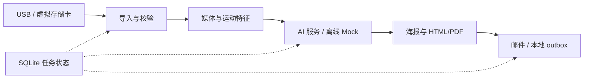

<div align="center">


# Day Distiller Desktop

### 将一天的片段，整理成值得回看的记忆。

Day Distiller 可穿戴设备的桌面伴侣：可靠导入、多模态分析与每日日志。

**Windows x64 · Apple Silicon macOS · Python / PySide6**

[English](README.md) · **简体中文**

[项目与固件](https://github.com/zjmdong/Day_Distiller/blob/firmware-production/README.zh-CN.md) · [快速开始](#快速开始) · [二次开发](#二次开发) · [硬件文档](https://github.com/zjmdong/Day_Distiller/blob/firmware-production/docs/HARDWARE.zh-CN.md)

</div>

---

## 简介

Day Distiller 是 **JerryZ** 独立开发的软硬件一体化项目。定制可穿戴设备采集短暂的视频、声音与运动信息，桌面应用将这些记录整理成每日回忆，而不仅是另一个媒体文件夹。

桌面端覆盖设备通信、存储校验、可恢复后台任务、原生界面、媒体预处理、AI 编排及报告发送，与定制电子硬件、固件和磁吸外壳一起构成五个月的完整项目。

> 这里是当前 **`desktop-app`** 分支，包版本 **0.3.0**。项目主入口和固件位于 [`firmware-production`](https://github.com/zjmdong/Day_Distiller/tree/firmware-production)。`old/*` 保留早期开发快照，不建议作为新开发起点。当前应用界面主要使用中文。

## 使用体验

**连接 → 校验 → 选择日期 → 蒸馏 → 回看**

| 页面 | 已实现能力 |
| :--- | :--- |
| **开始** | 引导式设备发现与同步，显示进度并提供重试路径 |
| **回忆** | 按日期查看日志、修改、重新生成及再次发送 |
| **形象与风格** | 参考人像、五种内置艺术风格、自定义提示与单次试片 |
| **设置** | 服务配置、系统凭据库以及开发者工具 |

界面背后的能力：

- USB CDC 自动识别，通过 capabilities 兼容早期及 2.0/2.1 固件，按设备能力开放 MSC 与配置功能。
- 导入时校验文件大小和 SHA-256；SQLite 保存任务与恢复状态。
- FFprobe/FFmpeg 媒体验证、关键帧提取；IMU 特征及启发式活动分类，并支持可选 scikit-learn 模型。
- 通过可配置适配器组织 Qwen 音视频分析、DeepSeek 全天瞬间筛选与 Seedream 图像生成。
- 生成 3:4 插画海报、HTML/PDF 日志和内嵌图片邮件，保存发送回执；源记录清理是独立校验步骤，不是复制后的立即副作用。
- 确定性 Mock AI 与本地 `.eml` 输出，无需云端密钥或邮件服务即可验证工作流。

## 快速开始

### 环境要求

- **Python 3.11** 为参考开发/构建版本；`pyproject.toml` 声明支持 3.11 及以上。
- 从源码运行时，`PATH` 中需可找到 **FFmpeg 和 FFprobe**；打包版本会内置。
- 面向 Windows x64 与 Apple Silicon macOS。代码存在 Linux 数据目录回退逻辑，但不代表 Linux 设备集成已得到支持。

建议与固件分别克隆：

```sh
git clone --branch desktop-app https://github.com/zjmdong/Day_Distiller.git Day_Distiller_Desktop
cd Day_Distiller_Desktop
```

**Windows / PowerShell**

```powershell
py -3.11 -m venv .venv
.\.venv\Scripts\python.exe -m pip install -e ".[dev]"
ffmpeg -version
ffprobe -version
.\.venv\Scripts\python.exe -m day_distiller_client
```

**Apple Silicon macOS** — 使用原生 arm64 Python 3.11：

```sh
python3.11 -m venv .venv
source .venv/bin/activate
python -m pip install -e '.[dev]'
ffmpeg -version
ffprobe -version
python -m day_distiller_client
```

### 无设备、无 API Key 体验

1. 准备一份兼容 TF 卡记录的**副本**。每个 `REC_NNNN_YYMMDD_HHMMSS` 目录包含 `video.avi`、`audio.wav`、`imu.json` 和 `meta.json`，详见[记录格式](https://github.com/zjmdong/Day_Distiller/blob/firmware-production/docs/GETTING_STARTED.zh-CN.md#5-理解记录格式)。仓库刻意不附带个人录制素材。
2. 进入**设置 → 开发者设置**，在记录页选择虚拟 TF 卡目录和日期。
3. 在生成页选择**离线演示（零云端调用）**，保持“删除虚拟卡记录”选项**关闭**。
4. 导入并运行。Mock 不调用 AI 或 SMTP，邮件保存到应用数据目录下的 `mock_outbox`；媒体预处理仍在本机执行。

Mock 用于验证流程与展示，不代表真实 AI 效果。没有记录素材时，也可运行使用测试夹具的自动化测试。

### 连接真实设备

准备兼容 [HW 2.0 固件](https://github.com/zjmdong/Day_Distiller/tree/firmware-production)、数据线与已备份的 TF 卡。由应用通过 `HELLO` 探测协议接口，不凭串口名称猜测，也不要让终端占用该接口。进入存储模式会重新枚举 USB，端口名称可能改变。

从只读导入开始，退出 MSC 前先安全弹出。现代事务固件使用设备导出清单和显式清理提交；早期设备使用单独校验的主机侧清理。导入或生成失败不能当作允许删除源记录的依据。

### 开启真实生成

在设置中填写自己的服务端点、模型 ID 和凭据，再设置邮件及外观。服务可用性和费用取决于外部平台，应在自己的账号中确认，不默认配置即拥有调用权限。

| 指南 | 内容 |
| :--- | :--- |
| [模型配置](docs/mainland-model-setup.md) | Qwen、DeepSeek、Seedream |
| [完整用户指引](docs/user-guide.md) | 日常使用与 Resend SMTP |
| [参考形象与风格](docs/avatar-setup.md) | 人像与视觉方向 |
| [固件兼容说明](docs/firmware-2.1-desktop-adaptation.md) | capabilities、状态和设备设置 |
| [排障](docs/usb-ffmpeg-troubleshooting.md) | USB、存储与媒体工具 |

SMTP 接受邮件只表示服务器已接受，不代表收件人已经阅读。用重要源数据前，请检查清理相关选项。

## 系统结构



| 源码 | 职责 |
| :--- | :--- |
| [`app.py`](src/day_distiller_client/app.py)、[`ui_theme.py`](src/day_distiller_client/ui_theme.py) | PySide6 界面、导航、工作线程进度 |
| [`protocol.py`](src/day_distiller_client/protocol.py)、[`device.py`](src/day_distiller_client/device.py) | SLIP/CRC32、设备发现及命令 |
| [`device_workflow.py`](src/day_distiller_client/device_workflow.py)、[`export_adapter.py`](src/day_distiller_client/export_adapter.py) | 固件能力、导入会话及清理适配 |
| [`legacy_import.py`](src/day_distiller_client/legacy_import.py)、[`database.py`](src/day_distiller_client/database.py) | 文件校验、任务与历史持久化 |
| [`media.py`](src/day_distiller_client/media.py)、[`imu_analysis.py`](src/day_distiller_client/imu_analysis.py) | 媒体预处理与运动特征 |
| [`providers/`](src/day_distiller_client/providers)、[`pipeline.py`](src/day_distiller_client/pipeline.py) | 外部/Mock 服务与工作流编排 |
| [`reporting.py`](src/day_distiller_client/reporting.py)、[`credentials.py`](src/day_distiller_client/credentials.py) | HTML/PDF 与系统凭据库 |

## 二次开发

激活虚拟环境后运行：

```sh
python -m pytest -q
```

测试覆盖协议、导入校验、任务状态、恢复、provider、报告和 UI。Mock 测试不是实机耐久测试，也不验证真实服务商。不要将个人录制素材或生产密钥作为测试夹具。

在**目标平台本机**执行 Nuitka 打包：

```powershell
# Windows x64
.\scripts\build.ps1
```

```sh
# Apple Silicon macOS
./scripts/build_macos.sh
```

产物为 `dist/DayDistiller-Windows-x64.zip` 和 `dist/DayDistiller-macOS-AppleSilicon.zip`，应分发完整包而非单个可执行文件。参阅[构建说明](docs/nuitka-build.md)与需手动触发的 [Windows/macOS 工作流](.github/workflows/build-desktop.yml)。macOS 使用临时签名，不等于 Developer ID 公证。

扩展 AI 时，在 [`providers/base.py`](src/day_distiller_client/providers/base.py) 的接口上实现新服务、接入工作流并添加 Mock 测试；修改 USB 时，应同步更新 C 固件与 Python 实现，保留能力协商。

## 数据、隐私与限制

| 平台 | 默认数据目录 |
| :--- | :--- |
| Windows | `%LOCALAPPDATA%\DayDistillerV2` |
| macOS | `~/Library/Application Support/Day Distiller` |
| 覆盖设置 | 启动前设置 `DAY_DISTILLER_DATA_DIR` |

导入媒体、日志成品、缓存与 SQLite 是普通本地文件，**不是加密保险库**。API/SMTP 凭据使用系统 keyring；设置界面可能明文回显已保存凭据，请避免截图、录屏或旁观泄露。

真实生成会将选中媒体与上下文发送到外部 AI 服务，并使用外部邮件服务；离线 Mock 不会。开启真实模式前检查拍摄同意、收件人与服务政策。AI 可能遗漏或误解细节，活动分类也不是精确测量结论。更长期的实机中断测试、佩戴研究与可靠性验证仍属于后续工作。

## 作者与许可

**JerryZ** — 独立开发，与 Day Distiller 定制硬件和固件共同构成完整系统。

仓库未指定项目级软件许可证。公开可见不等于开源授权，复用或再分发前请联系作者；第三方依赖保留各自许可证，原始硬件制造资料不公开。
