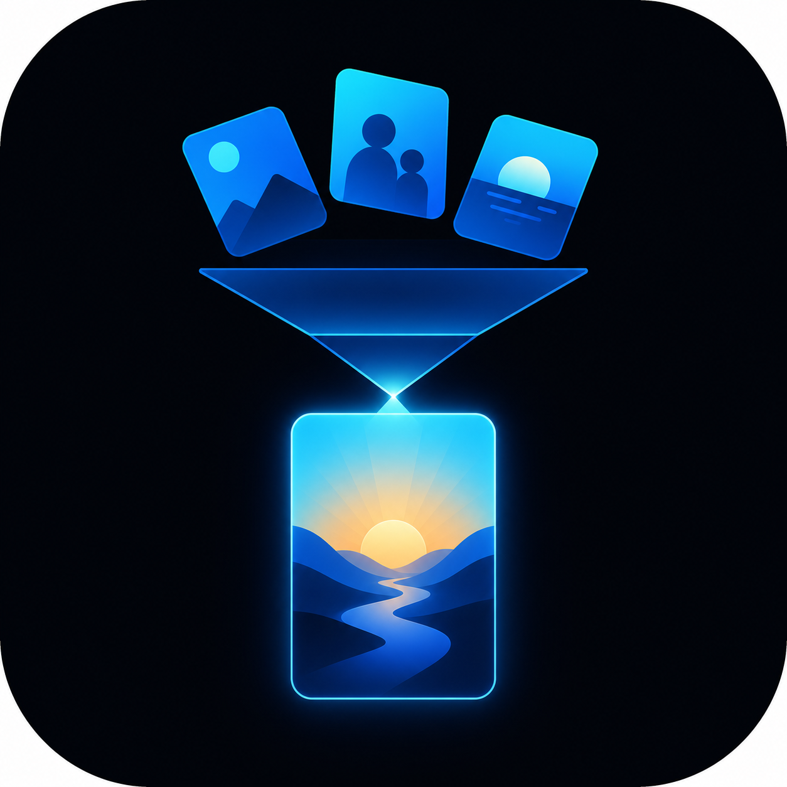

<div align="center">



# Day Distiller Desktop

### 为一天里值得记住的片刻，留一个位置。

从日常片段出发，重新读到值得回看的一天。

**设备连接 · 校验导入 · 每日日记 · 插画记忆**

[English](README.md) · **简体中文**

[项目首页](https://github.com/zjmdong/Day_Distiller/blob/firmware-production/README.zh-CN.md) · [使用体验](#使用体验) · [功能](#功能) · [快速开始](#快速开始) · [硬件文档](https://github.com/zjmdong/Day_Distiller/blob/firmware-production/docs/HARDWARE.zh-CN.md)

</div>

---

## 简介

构成一天的许多瞬间太小，发生时不容易被注意到。Day Distiller 可穿戴设备记录日常的短暂片段，而桌面应用为这些片段提供一个可以回看的地方。

连接设备、选择日期，将记录导入本地资料库；应用再根据画面、声音与运动信息，辅助整理出一篇日记和一张插画海报。回忆一天，也可以像重读一个故事。

桌面应用与定制硬件、固件和 AI 工作流由一人独立完成，共同构成[完整的 Day Distiller 项目](https://github.com/zjmdong/Day_Distiller/blob/firmware-production/README.zh-CN.md)。

## 使用体验

**连接 → 校验 → 浏览 → 蒸馏 → 回看**

- **清晰的连接引导。** 找到设备、选择日期，并在导入过程中查看进度。
- **可信赖的本地资料库。** 文件完成校验后进入当天的记录；中断的任务可以重试。
- **有语境的每日日记。** 借助 AI 将不同记录中的线索汇集成整日的回顾。
- **属于自己的视觉结果。** 视觉风格与参考形象决定海报的呈现，历史日记可以继续浏览与编辑。

## 功能

| 页面与内容 | 体验 |
| :--- | :--- |
| **开始** | 引导连接、按日期导入记录、生成当日日记。 |
| **回忆** | 按日期浏览、编辑和重新生成日记。 |
| **形象与风格** | 设置参考形象、视觉风格并预览海报效果。 |
| **分享** | 插画海报、PDF 导出和邮件。 |
| **设置** | 设备选项、AI 服务及离线演示。 |

## 技术栈

Python · PySide6 · SQLite · Pydantic · FFmpeg · NumPy · scikit-learn · pytest · Nuitka

## 快速开始

安装 Python 3.11 和 FFmpeg/FFprobe，再克隆桌面分支。

**Windows（PowerShell）**

```powershell
git clone --branch desktop-app https://github.com/zjmdong/Day_Distiller.git Day_Distiller_Desktop
cd Day_Distiller_Desktop
py -3.11 -m venv .venv
.\.venv\Scripts\python.exe -m pip install -e ".[dev]"
.\.venv\Scripts\python.exe -m day_distiller_client
```

**Apple Silicon macOS**

```sh
git clone --branch desktop-app https://github.com/zjmdong/Day_Distiller.git Day_Distiller_Desktop
cd Day_Distiller_Desktop
python3.11 -m venv .venv
source .venv/bin/activate
python -m pip install -e '.[dev]'
python -m day_distiller_client
```

没有设备或云端服务时，可进入**设置 → 开发者设置**，选择一份兼容记录的副本，在生成页开启**离线演示**，保持虚拟卡删除选项关闭。记录文件说明见[固件上手指南](https://github.com/zjmdong/Day_Distiller/blob/firmware-production/docs/GETTING_STARTED.zh-CN.md)。

日常使用时，通过 USB 连接设备，导入某一天的记录，再从“开始”页生成日记。AI 与邮件服务可在设置中添加。当前界面以中文为主。

## 面向开发者

| 方向 | 起点 |
| :--- | :--- |
| 桌面应用 | [应用源码](src/day_distiller_client) |
| 硬件与固件 | [项目主分支](https://github.com/zjmdong/Day_Distiller/tree/firmware-production) · [硬件接口](https://github.com/zjmdong/Day_Distiller/blob/firmware-production/docs/HARDWARE.zh-CN.md) |
| 设备连接 | [USB 集成](https://github.com/zjmdong/Day_Distiller/blob/firmware-production/docs/USB_INTEGRATION.md) |
| 应用体验 | [用户指引](docs/user-guide.md) · [AI 服务配置](docs/mainland-model-setup.md) |

## 构建与文档

```sh
python -m pytest -q
```

在目标平台使用 scripts/build.ps1（Windows）或 scripts/build_macos.sh（Apple Silicon macOS）构建。

- [用户指引](docs/user-guide.md)
- [AI 服务配置](docs/mainland-model-setup.md) · [邮件配置](docs/smtp-setup.md)
- [构建文档](docs/nuitka-build.md) · [排障文档](docs/usb-ffmpeg-troubleshooting.md)

## 许可

此分支采用[知识共享 署名—非商业性使用 4.0 国际许可协议](LICENSE.md)（CC BY-NC 4.0）。
